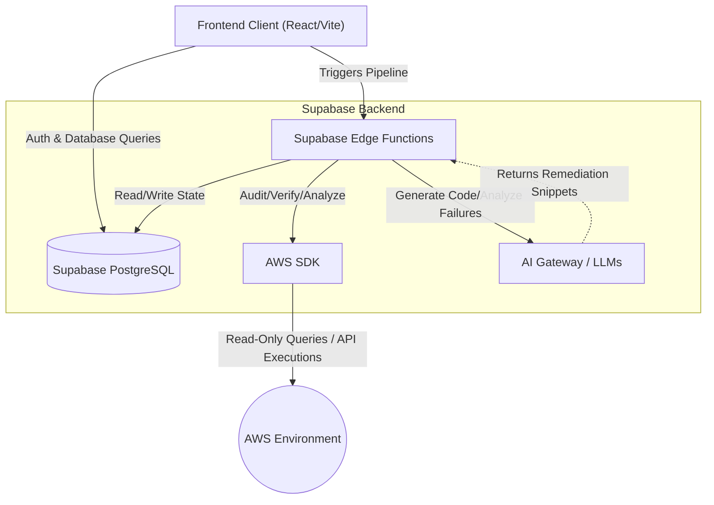

# Blastline Cloud Security Platform

**Blastline** is a read-only, zero-exploit cloud security auditing and remediation platform engineered for modern AWS environments. It provides deep visibility into misconfigurations, IAM vulnerabilities, and attack vectors, ensuring compliance with CIS, NIST, SOC2, and PCI standards.

For an exhaustive and deeply technical look at the platform, please refer to the [Technical Documentation](TECHNICAL_DOCUMENTATION.md).

---

## Key Features

*   **Continuous AWS Auditing:** Agentless, read-only scans that evaluate IAM, S3, EC2, RDS, Lambda, and KMS for vulnerabilities.
*   **Attack Path Analysis:** Correlates findings to build multi-stage breach paths to show exact privilege escalation vectors.
*   **Blast Radius Engine:** Visualizes the theoretical damage of a compromised IAM Role or resource.
*   **Principal Replay:** Forensically analyzes AWS CloudTrail logs to detect anomalous behaviors.
*   **IaC Drift & Plan Review:** Detects ClickOps drift and provides automated security reviews for Terraform plans.
*   **AI-Driven Remediations:** Generates exact CLI/Terraform snippets to fix findings. Supports an auditable human-in-the-loop lifecycle (Review, Approve, Execute, Verify).

---

## System Architecture


<div align="center"><em>Figure 1: Blastline System Architecture Flow</em></div>

### Brief Flow-by-Flow
1. **User Request:** The operator uses the UI to trigger an audit or remediation.
2. **Database:** The UI authenticates and reads connection parameters directly from the Supabase Postgres Database via RLS.
3. **Execution Pipeline:** A Supabase Edge Function is invoked, which executes read-only API calls via the AWS SDK.
4. **AI Generation:** The Edge Function queries an AI model to evaluate logic and generate remediation code.
5. **Storage:** The data and strict execution logs are persisted back to the database.

*(For detailed architectural flow, see the [Technical Documentation](TECHNICAL_DOCUMENTATION.md))*

---

## Tech Stack

*   **Frontend:** React, Vite, TypeScript, Tailwind CSS, Shadcn UI, Framer Motion, ReactFlow, Lucide Icons.
*   **Backend & Auth:** Supabase (PostgreSQL, Edge Functions, Row Level Security).
*   **Edge Functions:** Deno, TypeScript, AWS SDK v3.
*   **AI Providers:** OpenAI / Lovable AI Gateway.
*   **Tooling:** npm, ESLint, Vitest.

---

## Detailed Setup Steps

Follow these steps to bootstrap the project, run it locally, and connect it to your AWS environment.

### 1. Prerequisites
*   Node.js (v18+) & npm
*   [Docker](https://www.docker.com/) (Required for running Supabase locally)
*   [Supabase CLI](https://supabase.com/docs/guides/cli) (`npm install -g supabase`)

### 2. Repository Setup
Clone the repository and install dependencies:
```bash
git clone <repository_url>
cd blastline
npm install
```

### 3. Local Supabase Setup
Start the local Supabase stack. This will provision the PostgreSQL database, Authentication, Storage, and Edge Functions locally using Docker.
```bash
npx supabase start
```
*Note: Make sure Docker is running on your machine.*

### 4. Environment Variables
Create a `.env` file in the root directory and populate it with the API keys provided by the `supabase start` command:
```env
VITE_SUPABASE_URL=http://127.0.0.1:54321
VITE_SUPABASE_ANON_KEY=<your_anon_key_from_supabase_start>
```

Set up secrets for Edge Functions (e.g., your OpenAI key) in the Supabase local vault:
```bash
npx supabase secrets set OPENAI_API_KEY="sk-your_api_key_here"
```

### 5. Running the Application
Start the frontend Vite development server:
```bash
npm run dev &
```
The application will be accessible at `http://localhost:8080` (or the port specified by Vite).

### 6. Setting Up AWS Credentials (In-App)
To actually perform audits, you must configure AWS credentials through the UI:
1. Navigate to the **Connections** page in the Blastline application.
2. Click **New Connection**.
3. You can connect using an **IAM Cross-Account Role ARN** (recommended for production) or **Direct IAM User Access Keys**.
4. The principal you connect with must have read-only access (e.g., `arn:aws:iam::aws:policy/SecurityAudit` and `arn:aws:iam::aws:policy/ReadOnlyAccess`).
5. If you plan to execute AI remediations directly from the UI, the connected principal will also need the necessary Write/Put permissions for those specific services.
6. The application will verify the connection and securely store the credentials encrypted within the Supabase database.

### 7. Running Tests
To run the Vitest test suite:
```bash
npm run test
```
